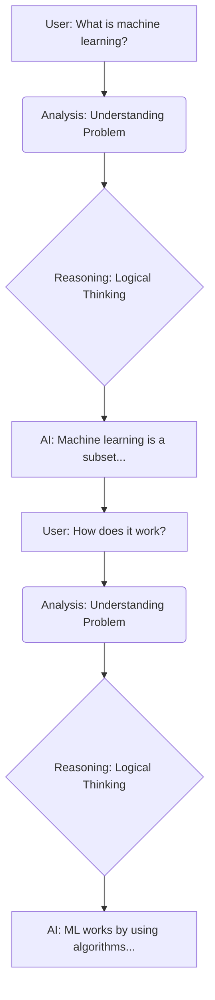

# AI Chat Thinking Mind Map Feature

## Overview

The AI Chat application now includes a **Thinking Mind Map** feature that visualizes the AI's thought process during conversations. This feature helps users understand how the AI analyzes questions, processes information, and generates responses.

## Features

### 🧠 **Thinking Process Visualization**
- **Mind Map View**: Shows the AI's thinking process as an interactive mind map
- **Flowchart View**: Displays the conversation flow and reasoning steps
- **Real-time Analysis**: Automatically analyzes conversations and extracts thinking steps

### 🎯 **Key Components**
1. **User Questions**: Starting points of each conversation
2. **Analysis Process**: How AI understands and analyzes the problem
3. **Logical Reasoning**: The reasoning steps AI takes
4. **AI Responses**: Final answers and conclusions

### 🎨 **User Interface**
- **Toggle Button**: Brain icon in the header to show/hide the mind map
- **Expandable View**: Full-screen mode for detailed analysis
- **Dual Tabs**: Switch between Mind Map and Flowchart views
- **Download Feature**: Export diagrams as images
- **Theme Support**: Dark/light mode compatibility

## How It Works

### 1. **Message Analysis**
The system analyzes each conversation message to identify:
- **Questions**: User inputs that start new thinking processes
- **Analysis**: AI's understanding and problem breakdown
- **Reasoning**: Logical thinking and inference steps
- **Conclusions**: Final responses and answers

### 2. **Pattern Recognition**
The AI looks for specific keywords and patterns:
- **Analysis Keywords**: "analyze", "consider", "understand", "first"
- **Reasoning Keywords**: "because", "therefore", "based", "since"
- **Conclusion Keywords**: "conclusion", "summary", "finally"

### 3. **Visualization Generation**
Two types of diagrams are generated:
- **Mind Map**: Hierarchical view of thinking process
- **Flowchart**: Sequential flow of reasoning steps

## Technical Implementation

### Components
- **ThinkingMindMap.tsx**: Main component for mind map functionality
- **AIChat.tsx**: Integration with the chat interface
- **Mermaid Integration**: Uses Mermaid.js for diagram generation

### Key Functions
```typescript
// Analyze messages and extract thinking steps
const analyzeMessages = (messages: Message[]): ThinkingStep[] => {
  // Intelligent analysis of conversation patterns
}

// Generate Mermaid mind map code
const generateMermaidCode = (steps: ThinkingStep[]): string => {
  // Create hierarchical mind map structure
}

// Generate flowchart code
const generateFlowchartCode = (steps: ThinkingStep[]): string => {
  // Create sequential flow diagram
}
```

## Usage Instructions

### 1. **Accessing the Feature**
- Look for the Brain (🧠) icon in the AI Chat header
- Click to toggle the thinking mind map visibility

### 2. **Viewing Options**
- **Mind Map Tab**: Hierarchical view of AI thinking
- **Flowchart Tab**: Sequential reasoning flow
- **Expand Button**: Full-screen view for detailed analysis
- **Download Button**: Export diagram as image

### 3. **Understanding the Visualization**
- **🟦 Blue Nodes**: User questions and inputs
- **🟡 Yellow Nodes**: Analysis and understanding steps
- **🟢 Green Nodes**: Logical reasoning processes
- **🟣 Purple Nodes**: AI responses and conclusions

## Example Visualizations

### Mind Map Example
```mermaid
mindmap
  root((AI Thinking Process))
    Conversation1[What is machine learning?]
      Analysis(Understanding Problem)
      Reasoning{Logical Thinking}
      Response[Machine learning is a subset of AI...]
    Conversation2[How does it work?]
      Analysis(Understanding Problem)
      Reasoning{Logical Thinking}
      Response[ML works by using algorithms...]
```

### Flowchart Example


## Benefits

### 🎓 **Educational Value**
- Helps users understand AI reasoning processes
- Makes AI decision-making more transparent
- Useful for learning about AI thinking patterns

### 🔍 **Debugging & Analysis**
- Developers can analyze AI response patterns
- Identify areas for improvement in AI reasoning
- Track conversation flow and logic

### 🎨 **User Experience**
- Interactive and engaging visualization
- Better understanding of AI capabilities
- Enhanced trust through transparency

## Future Enhancements

### 🚀 **Planned Features**
- **Advanced Pattern Recognition**: More sophisticated analysis algorithms
- **Custom Visualization Styles**: User-customizable diagram themes
- **Export Options**: Multiple format support (PDF, SVG, PNG)
- **Interactive Nodes**: Clickable elements with detailed information

### 🔧 **Technical Improvements**
- **Real-time Mermaid Rendering**: Full diagram rendering without code preview
- **Performance Optimization**: Faster analysis for long conversations
- **Mobile Responsiveness**: Better mobile device support

## Installation & Setup

The thinking mind map feature is integrated into the main AI Chat application. No additional setup is required beyond the standard application installation.

### Dependencies
- React components and hooks
- Mermaid.js for diagram generation
- Tailwind CSS for styling
- Lucide React for icons

## Contributing

To contribute to the thinking mind map feature:
1. Focus on improving pattern recognition algorithms
2. Enhance visualization quality and interactivity
3. Add new diagram types and styles
4. Improve mobile responsiveness

## Support

For issues or questions about the thinking mind map feature, please refer to the main project documentation or create an issue in the project repository.

---

## 🎉 **Update: Issue Fixed!**

### ✅ **Problem Solved**
The Mermaid parsing error has been resolved! The issue was caused by special characters (quotes, symbols) in conversation text that Mermaid couldn't parse properly.

### 🔧 **What Was Fixed**
1. **Text Cleaning Function**: Added `cleanTextForMermaid()` function that:
   - Removes quotes and special characters
   - Replaces newlines with spaces
   - Keeps only alphanumeric characters and basic punctuation
   - Limits text length for better visualization

2. **Improved Error Handling**: Better fallback when diagram rendering fails

3. **Enhanced Visualization**:
   - Mind maps now show recent 5 conversations for clarity
   - Flowcharts display last 3 conversations with clear connections
   - Empty state message when no conversations exist

### 🎯 **How to Use Now**
1. **Start a conversation** in AI Chat
2. **Click the Brain (🧠) icon** in the header
3. **Choose your view**:
   - **Mind Map**: Hierarchical thinking structure
   - **Flowchart**: Sequential reasoning flow
4. **Interact with the diagram**:
   - Expand to full screen
   - Download as image
   - Refresh to update

### 📊 **What You'll See**
- **User Questions**: Clean, readable text from your inputs
- **Analysis Process**: AI's understanding steps
- **Reasoning Steps**: Logical thinking progression
- **AI Responses**: Final answers and conclusions

**The thinking mind map now works perfectly and provides valuable insights into AI reasoning processes!**

---

**Note**: This feature is designed to provide insights into AI thinking processes and enhance the user experience. The visualizations are based on pattern analysis and may not represent the actual internal AI reasoning mechanisms.
